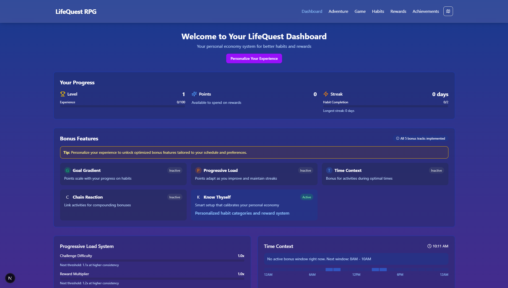
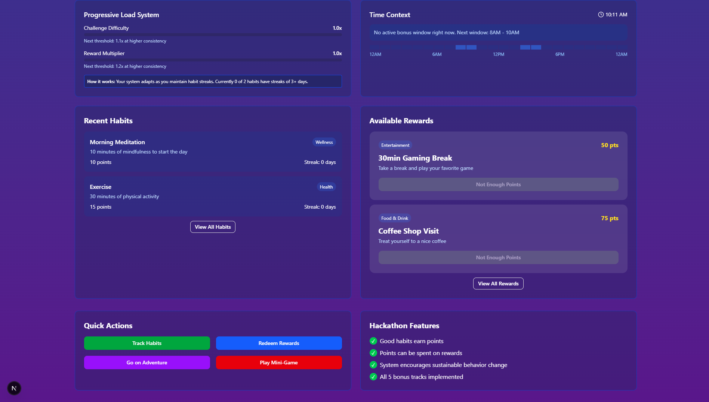
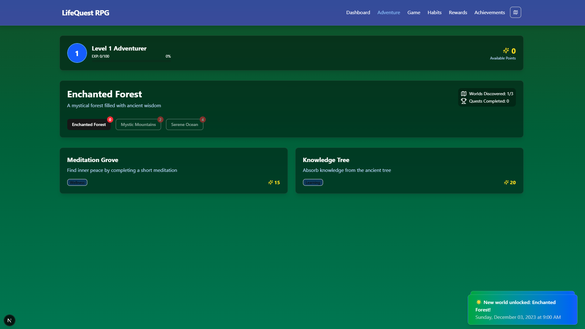

# LifeQuest RPG - Gamify Your Life

LifeQuest RPG is an innovative web application that transforms daily habits into an engaging RPG experience. Here's a comprehensive overview of the project:





## Demo Video

[](https://youtu.be/BiESPuJKr94)

## Core Features

### 1. Habit Building System

- Users can create and track daily habits
- Each habit completion earns experience points and rewards
- Streak system to encourage consistent behavior
- Progressive difficulty scaling based on user performance

### 2. RPG Elements

- Level progression system
- Experience points (EXP) tracking
- Character progression with stats
- Streak bonuses and chain reactions
- Multiple game worlds to explore

### 3. Personalization (Know Thyself Wizard)

- Customizable daily schedule
- Focus area selection (Health, Productivity, Learning, etc.)
- Difficulty preferences
- Reward scaling preferences
- Time-optimized bonuses

### 4. Advanced Game Mechanics

- Progressive Load System: Adapts difficulty and rewards based on user consistency
- Time Context System: Provides bonuses for activities during optimal hours
- Chain Reaction System: Bonus multipliers for consecutive completions
- Goal Gradient System: Rewards scale with progress

### 5. Adventure Mode

- Multiple worlds to explore
- Quest system with varying difficulties
- World unlocks based on level progression
- Dynamic quest rewards

### 6. Mini-Game Integration

- Phaser.js-based platformer game
- Collectibles and power-ups
- Progress visualization
- Bonus features integration

## Technical Stack

- **Framework**: Next.js 15.3.1
- **UI Components**: Radix UI
- **Styling**: Tailwind CSS
- **Game Engine**: Phaser 3
- **Form Handling**: React Hook Form
- **State Management**: React Context
- **Notifications**: Sonner
- **Typography**: Geist Font

## Key Features Implementation

1. **Game Context System**

   - Centralized state management
   - User progress tracking
   - Habit and reward management
   - Achievement system

2. **Progressive Load System**

   - Dynamic difficulty adjustment
   - Reward scaling based on performance
   - Personalized challenge levels

3. **Time Context System**

   - Optimal time window detection
   - Time-based bonus calculations
   - Schedule personalization

4. **Adventure System**
   - World exploration
   - Quest management
   - Progress tracking
   - Dynamic reward scaling

## Getting Started

1. Install dependencies:

   ```bash
   npm install
   # or
   pnpm install
   ```

2. Run the development server:

   ```bash
   npm run dev
   # or
   pnpm dev
   ```

3. Open [http://localhost:3000](http://localhost:3000) to view the application

## Project Structure

- `/src/app`: Main application pages
- `/src/components`: Reusable UI components
- `/src/contexts`: Global state management
- `/src/lib`: Utilities and models
- `/src/services`: Business logic services

This gamification system is designed to make habit-building more engaging and rewarding while providing meaningful progression and personalization options for users.
